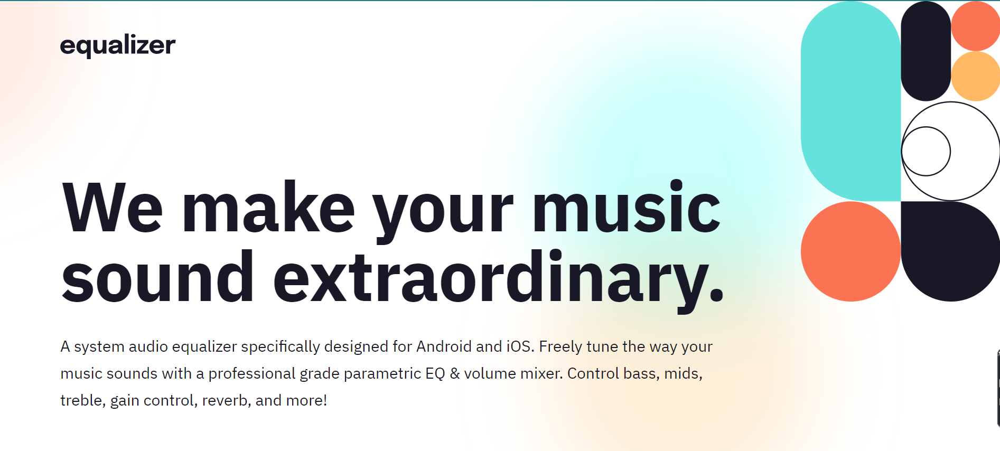

# Frontend Mentor - Equalizer landing page solution

## Table of contents

- [Overview](#overview)
  - [The challenge](#the-challenge)
  - [Screenshot](#screenshot)
  - [Links](#links)
- [My process](#my-process)
  - [Built with](#built-with)
  - [What I learned](#what-i-learned)
  - [Continued development](#continued-development)
  - [Useful resources](#useful-resources)

## Overview

This is a solution to the [Equalizer landing page challenge on Frontend Mentor](https://www.frontendmentor.io/challenges/equalizer-landing-page-7VJ4gp3DE).

### The challenge

The challenge was to build a responsive page from a figma design (https://www.figma.com/file/HB7XoWK6Ufc0Fy2TYawY2i/equalizer-landing-page?node-id=0%3A63&t=27GsXuWBErHidiZB-0) with different hover states for interactive elements.

### Screenshot

### Links

- Solution URL: [Solution URL here](https://github.com/Nuca29/Equalizer-Landing-Page.git)
- Live Site URL: [Live site URL here](https://nuca29.github.io/Equalizer-Landing-Page/)

## My process

### Built with

- Semantic HTML5 markup
- CSS custom properties
- Flexbox
- CSS Grid
- Mobile-first workflow

### What I learned

I practised building responsive web pages while working through this project. I tried to use percentages rather than fixed length units. Also I looked deeper into background image properties in CSS.

### Continued development

I would like to focus more on positioning objects in future projects, and practise using different types of length units to get the best outcome in terms of responsive design.

### Useful resources

- [Resource 1](https://css-tricks.com/almanac/properties/b/background-image/) - This is an amazing article about background-image and its related properties in CSS.
